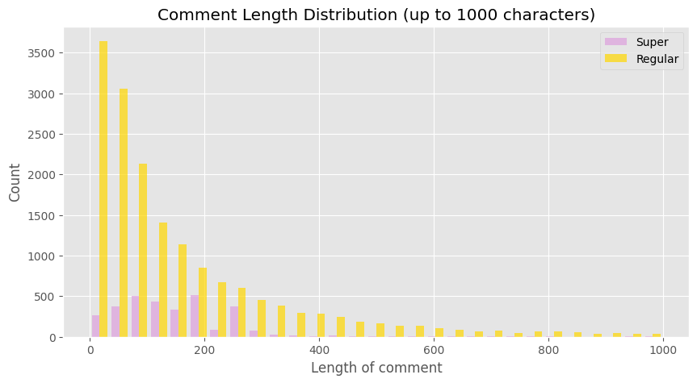
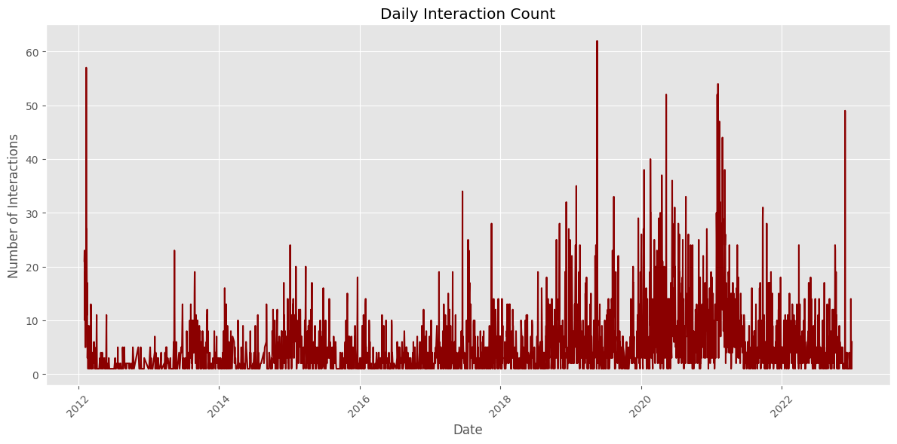
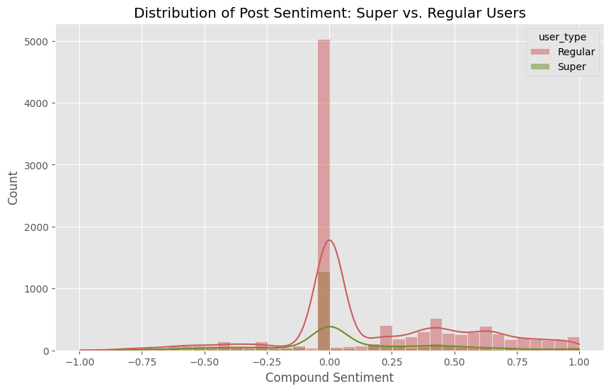
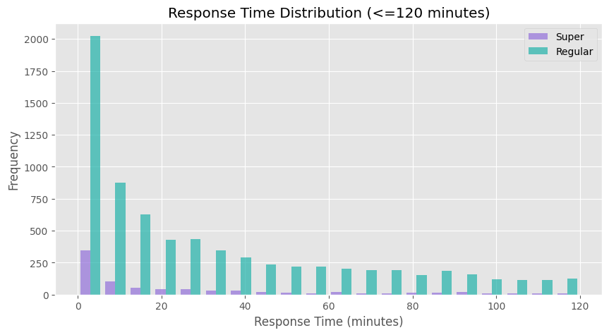
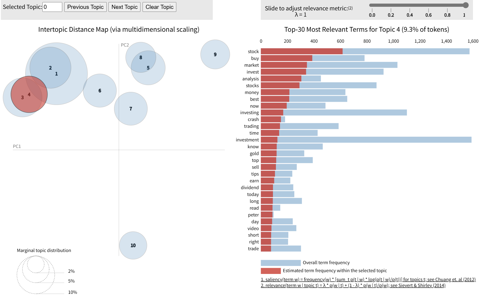
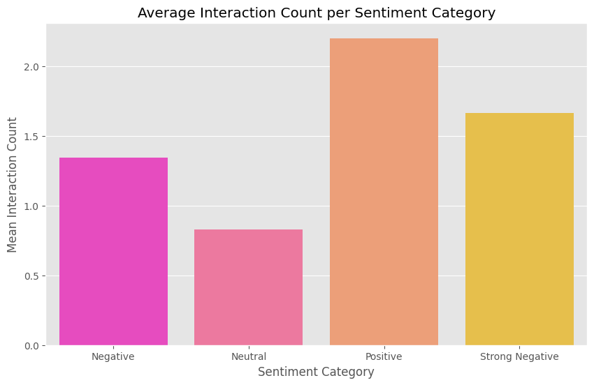
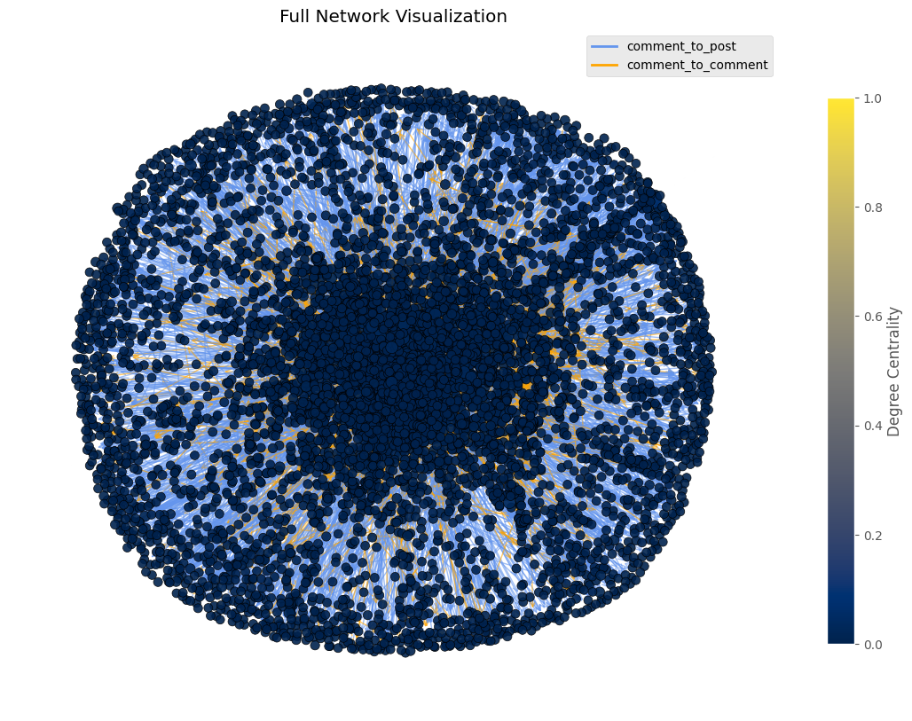
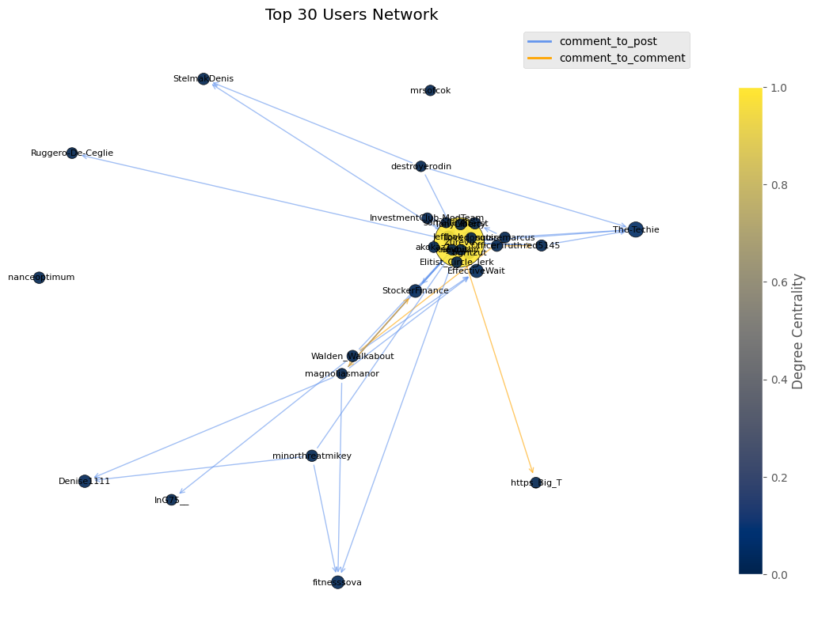
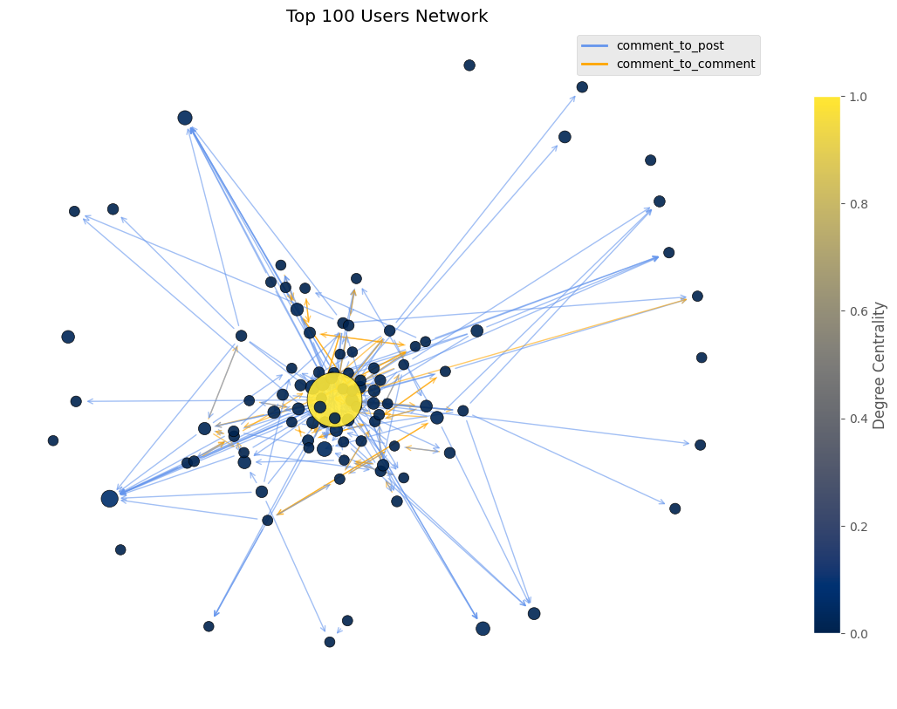
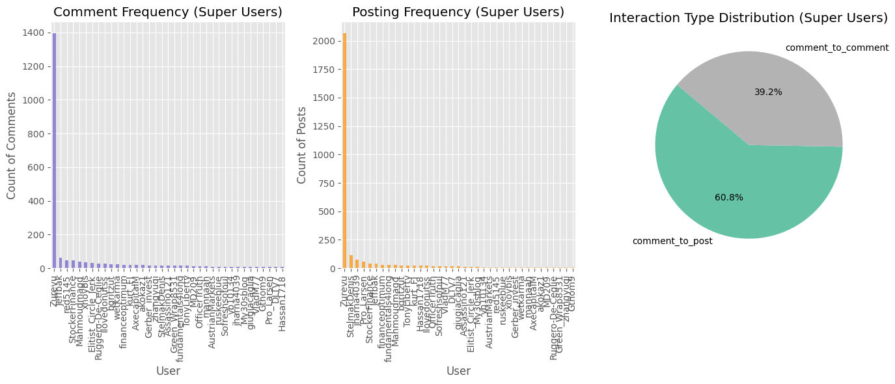

# Reddit Superuser & Topic Modeling Analysis
Reddit 超级用户与主题建模分析

This project conducts an in-depth analysis of Reddit user behavior and topic dynamics using Python. It combines NLP, sentiment analysis, topic modeling, and network science to extract meaningful insights from social media data.

---

## Overview

Using real-world Reddit data, this project addresses the following:

- What topics dominate the conversation?  
- Who are the most influential users?  
- How does user sentiment vary by topic?  
- What does the interaction network look like?

The analysis includes sentiment detection, network-based superuser identification, and unsupervised topic modeling using LDA.

---

## Techniques & Tools

- **NLP**: `nltk`, `spaCy`, `TextBlob` for tokenization, stopwords, and sentiment  
- **Topic Modeling**: `Gensim` LDA with `pyLDAvis` interactive visualization  
- **Network Analysis**: `NetworkX` for graph construction and centrality metrics  
- **Visualization**: `matplotlib`, `seaborn`, `pyLDAvis`

---

## Project Structure

reddit-analysis/  
├── Reddit_Analysis.ipynb      ← Jupyter notebook with all analysis steps  
├── stopwordFile.txt           ← Custom stopword list for topic modeling  
├── screenshots/               ← Saved visualizations from the notebook  
└── README.md                  ← Project description and insights  

---

## Screenshots & Results

### 📌 User Interaction & Sentiment

| Comments & Sentiment | Daily Engagement |
|----------------------|------------------|
|  |  |
|  |  |

---

### 📊 Topic Modeling (LDA)

| Topics & Trends |
|-----------------|
|  |
|  |
|  |

**Findings**:
- 10 major topics were identified, including *investment*, *cryptocurrency*, *crowdfunding*, and *finance*.  
- Topic 7 had the highest token weight, focused on *stock* and *crypto markets*.  
- Topics shifted in popularity over time, with peaks aligning to news cycles.

---

### 👑 Superuser Detection & Network

| Full Network View | Top Influencers |
|------------------|------------------|
|  |  |
|  |  |

**Insights**:
- A small group of users contributed disproportionately to overall interaction.  
- These "superusers" had high betweenness and degree centrality, acting as bridges.  
- They received more replies and interacted across multiple topics.

---

## Summary of Key Insights

- **Sentiment** skewed positive but varied significantly across topics.
- **Superusers** (top 5%) drove over 60% of total engagement.
- **LDA Topic Modeling** revealed high interest in finance, tech, and markets.
- **Interaction patterns** showed clear temporal and topical trends.

## Author
Xinyu Dai

Email: xinyudai2002.career@gmail.com
